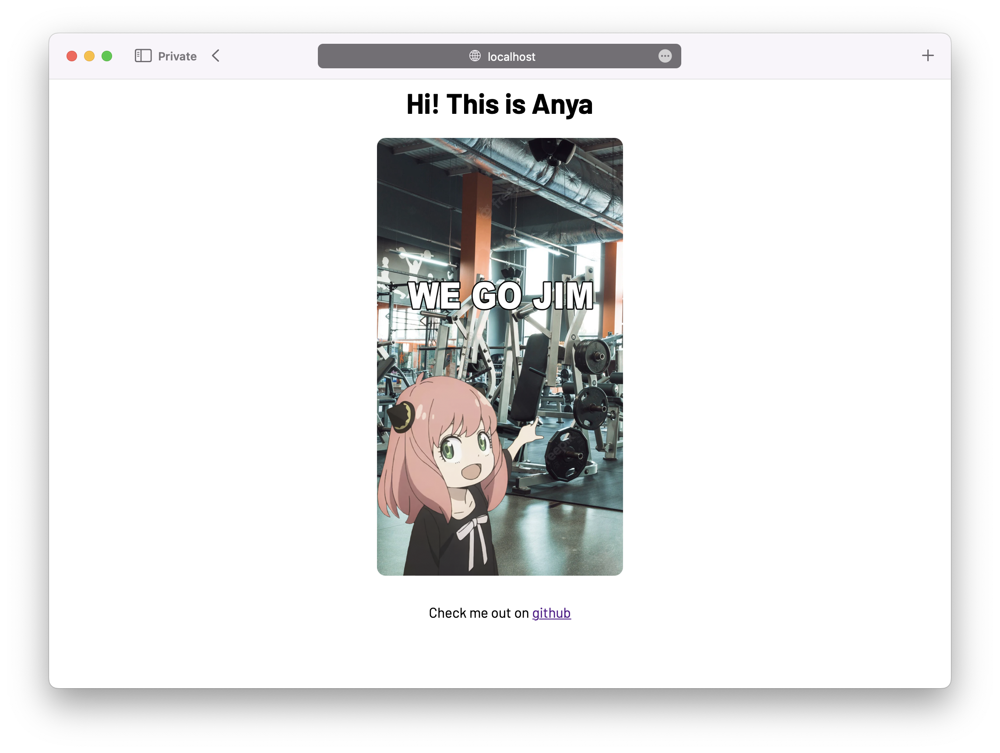

# Anya

A web server written from scratch in C++



# Building

build using

```shell
make
```

# TODO

- [ ] Add error handling
- [ ] Add tests
- [x] Add logging
- [ ] select()
- [ ] Document Code
- [ ] Use std::format (C++20) (response.cpp)
- [ ] Express like API